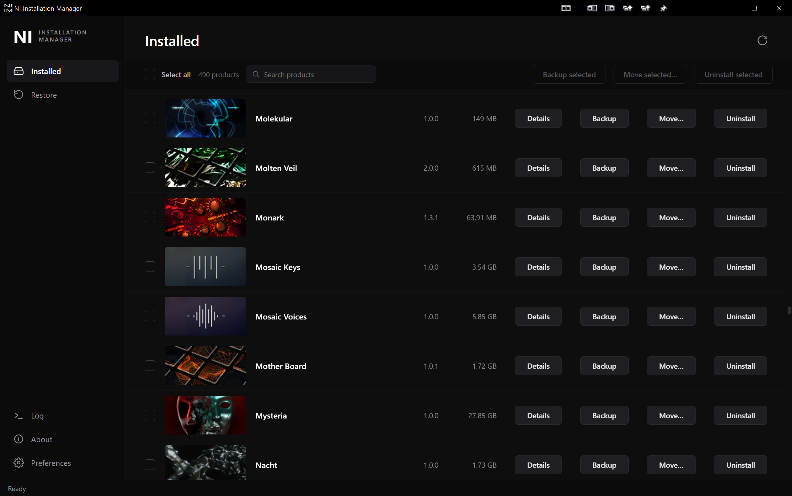

# NI Installation Manager

Unofficial tool to manage and uninstall Native Instruments products. **Not affiliated with Native Instruments.** Windows only.

## What It Does

- **Lists installed NI products** — scans the Windows registry, shows name, version, artwork, and disk usage per product.
- **Uninstalls instruments** — removes registry entries and product folders/files (AAX/VST2/VST3).
- **Backup instruments** — Back up selected products to a folder you choose.
- **Restores from backup** — browse and restore previously backed-up products.
- **Moves installed instruments** — relocate installed products to a different folder.

## Download

Windows installer, always the latest build, no version in the filename to bookmark:

**[⬇ Download NI-Installation-Manager-Setup.exe](https://github.com/andreashe/ni-installation-manager/releases/download/publish/NI-Installation-Manager-Setup.exe)**

Run the installer, then launch "NI Installation Manager" from the Start menu.

**Disclaimer**: This is a third-party tool. Use at your own risk. Always back up system files before uninstalling software.

>Warning: Do not use it to uninstall drivers. It is just made for instruments.

>INFO: Sophos Anti-Virus may flag this tool as a virus after admin rights are granted. Just can tell you, it is built here at github with the sources you see and there is no trick.

## Development

See [`docs/development.md`](./docs/development.md) for setup, running in dev mode, tests, and packaging. Architecture and design docs: [`docs/`](./docs/).
